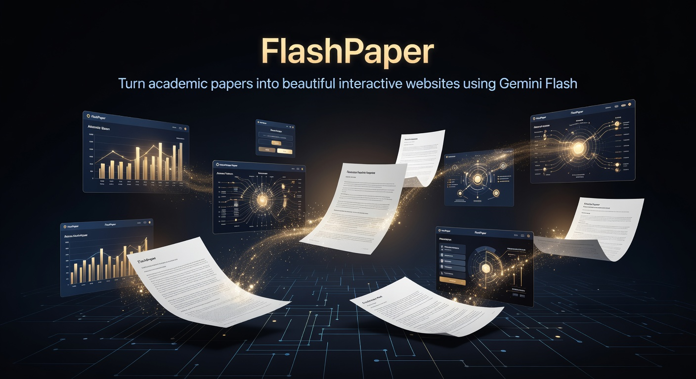
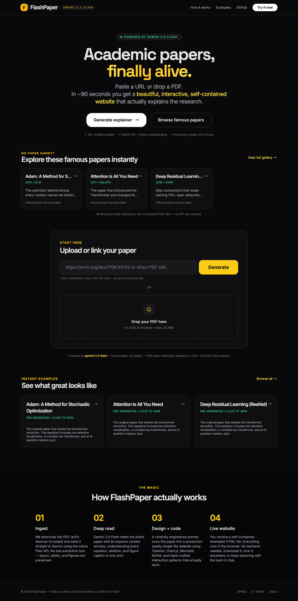
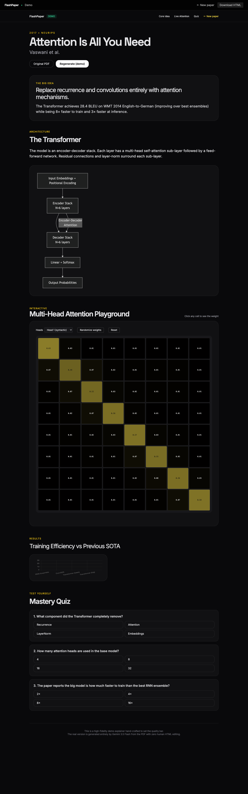

# FlashPaper



**Turn any academic paper into a beautiful, fully interactive, self-contained website — powered by Gemini Flash.**

Paste an arXiv link or drop a PDF. In ~90 seconds you get a production-grade interactive explainer with live diagrams, simulations, quizzes, and follow-up chat that actually understands the research.

Paste an arXiv link or drop a PDF. ~90 seconds later you have a production-grade interactive explainer with live diagrams, simulations, quizzes, and deep-dive chat that actually understands the research.

This is the ultimate stress test for long-context reasoning + high-quality code generation.

## Origin

This project was born from [this tweet by Jeff Dean](https://x.com/JeffDean/status/2056852774957252993), where researchers expressed a strong desire for a tool that could take any academic paper and instantly turn it into a rich, visual, interactive experience using the newly released Gemini Flash model.

## Quick Start (Local)

```bash
# 1. Clone
git clone https://github.com/intertwine/flashpaper
cd flashpaper

# 2. Install (uv is required)
uv sync

# 3. Add your Gemini key
cp .env.example .env
# Edit .env and put your real GEMINI_API_KEY

# 4. Run
uv run uvicorn app.main:app --reload
# Open http://localhost:8000
```

In demo mode (default until you add a key), the site only serves pre-seeded high-quality explainers instantly.

## How It Works

1. **Ingest** — Smart resolver for arXiv / DOI / direct PDF. Gemini Files API receives the real PDF (layout + figures preserved).
2. **Deep reasoning** — The full paper (often 15–30k tokens) + an extremely detailed prompt go to Gemini 3.5 Flash.
3. **Code generation** — The model emits a single, self-contained HTML file using Tailwind CDN, Chart.js, Mermaid, KaTeX, and clean JS. Every visualization is faithful to the paper.
4. **Live experience** — You get a shareable, downloadable website. Plus an in-browser chat for follow-up questions that sees the original paper.

## Tech

- Python + FastAPI + uv
- Zero frontend build (Jinja + Tailwind Play CDN + vanilla)
- `google-genai` SDK with Files API + context caching
- SQLite for metadata + file system for artifacts
- Strict linting: `ruff` + `basedpyright`

See the detailed [implementation plan](.grok/sessions/.../plan.md) for architecture decisions.

## Screenshots

### Landing Page with Famous Papers


### Interactive Demo Example (Attention Is All You Need)


The demos above are fully functional, self-contained websites generated (or hand-curated to the same standard) by Gemini Flash.

## Development Commands

```bash
uv run uvicorn app.main:app --reload          # dev server
uv run ruff check --fix && uv run ruff format # format + lint
uv run basedpyright app/                      # type check
```

## Project Status

This repo is being built live following the approved plan in `plan.md`. We are currently in **Phase 0–1** (scaffolding + ingestion).

When complete it will be publicly launchable at flashpaper.ai (or similar).

## License

MIT — go build cool things with it.

---

*Inspired by the 2026 X thread from Jeff Dean about the need for a tool that makes the newly released Gemini 3.5 Flash’s long-context + code-gen capabilities immediately tangible to researchers.*
